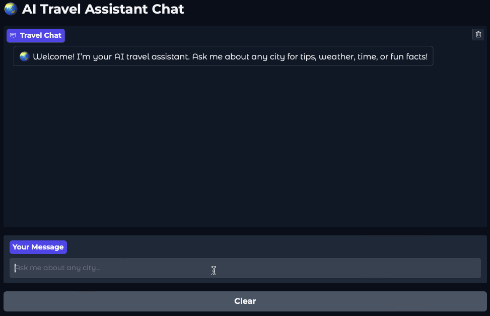

# 🌏 City Information Assistant API

A modern AI system that turns natural language queries into city insights and travel recommendations—using OpenAI Agents, tool orchestration, and real-time APIs.

---

[](https://your-gradio-link.here)



---

## 📚 Documentation

- [How It Works](https://github.com/Benybrahim/city-information-agent/wiki/How-It-Works)
- [API Overview](https://github.com/Benybrahim/city-information-agent/wiki/API-Reference)
- [Agents Overview](https://github.com/Benybrahim/city-information-agent/wiki/Agents)
- [Tools Overview](https://github.com/Benybrahim/city-information-agent/wiki/Tools)

---

## ✨ Features

* Natural-language chat about any city in the world
* Real-time **weather**, **local time**, and **facts**—via OpenAI tool calls
* Multi-turn travel planning and follow-up discussion
* Modular agent architecture (orchestration + tools)
* Robust API with error handling and clear JSON responses

---

## 📝 Requirements

* [](https://www.python.org/doc/)
  **Python 3.9 or higher**
  [Python Docs](https://docs.python.org/3/)

* [](https://github.com/astral-sh/uv)
  **uv** (fastest Python package manager)
  [uv Docs](https://github.com/astral-sh/uv)

* [](https://github.com/openai/openai-agents-python)
  **OpenAI Agents SDK**
  [OpenAI Agents SDK Docs](https://openai.github.io/openai-agents-python/)

* [](https://fastapi.tiangolo.com/)
  **FastAPI**
  [FastAPI Docs](https://fastapi.tiangolo.com/)

* [](https://docs.docker.com/get-docker/)
  **Docker** (for container deployment)
  [Docker Docs](https://docs.docker.com/)

---

## 🚀 Quick Start

1. **Install dependencies**

   ```bash
   uv pip install -r requirements.txt
   ```

2. Add `.env` to the repo for API Keys.

3. **Run the API server**

   ```bash
   uvicorn app.main:app --reload
   ```

4. **POST `/chat` request**

   ```bash
   curl -X POST -H "Content-Type: application/json" \
     -d '{"message": "Tell me about Kyoto"}' \
     http://localhost:8000/chat
   ```

---

## 🔗 API Usage

### **POST** `/chat`

* **Request:**

  ```json
  {"message": "Tell me about Kyoto"}
  ```

* **Sample Response:**

  ```json
  {
    "thinking": "I'll get facts, weather, and time for Kyoto.",
    "function_calls": [
      {"tool": "city_facts_tool", "parameters": {"city": "Kyoto"}},
      {"tool": "weather_tool", "parameters": {"city": "Kyoto"}},
      {"tool": "time_tool", "parameters": {"city": "Kyoto"}}
    ],
    "response": "Kyoto was once the capital of Japan. It's 27°C and clear. The local time is 11:14. Want trip suggestions?"
  }
  ```

---

## 🧪 Testing

Run all tests with:

  ```bash
    pytest
  ```

---

## 🐳 Running with Docker

Build and run using Docker Compose:

  ```bash
    docker compose up --build
  ```

The API will be available at [http://localhost:8000](http://localhost:8000).

---

## 🖥️ Interactive UI Demo

1. **Run API Server**

   ```bash
   uvicorn app.main:app --reload
   ```
2. **Run Gradio Demo**

   ```bash
   python demo/gradio_demo.py
   ```

The UI will be available at [http://localhost:7860](http://localhost:7860).